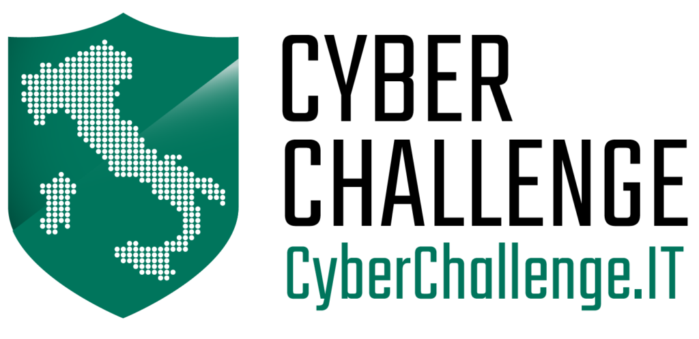
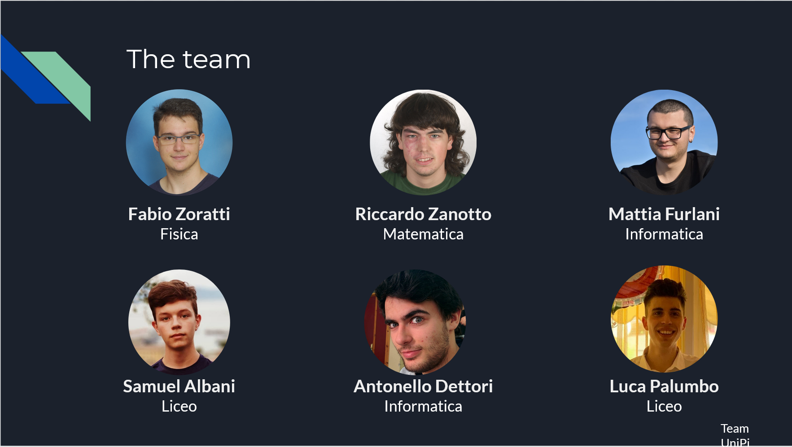
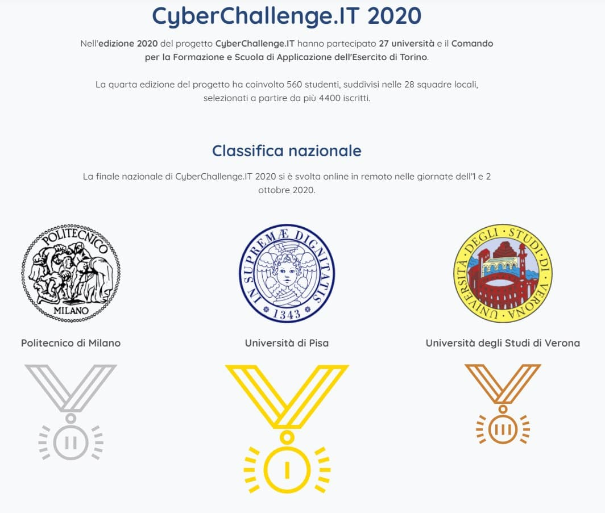

# Cyberchallenge 2020

## Inizio
Ho scoperto di [Cyberchallenge](https://cyberchallenge.it/) per caso quando ero in terza superiore. 
Ne ho sentito parlare per la prima volta su telegram, in uno dei milioni di gruppi di informatica e cybersecurity.

Incuriosito, mi sono informato meglio e ho deciso che avrei provato il test di ammissione per il corso all'università di Pisa. Quindi ho iniziato a prepararmi risolvendo vecchie gare delle olimpiadi di informatica.
Con mia grande sorpresa a febbraio 2020 ho superato prima il test di logica e poi il test di programmazione, competendo con 100 persone, molti dei quali universitari.

## Il corso

Cyberchallenge è un corso di 3 mesi di lezioni di cybersecurity ( 6 ore a settimana ). Le lezioni si concentrano sulla parte pratica, mettere mano sui programmi, sul codice, sulle vulnerabilità, scrivere exploit... A tenere le lezioni sono i professori e gli studenti della edizione precendete di cyberchallenge precedente (a pisa almeno).

Gli argomenti affrontati sono tantissimi. Binary exploitation, crittografia, Web security, hardware security, reverse engineering... Troppe cose per essere trattate con completezza in poco tempo, quindi molto del lavoro da fare per risolvere le sfide proposte è di approfondimento individuale. 

Durante il corso ci si accorge in fretta che alcune categorie di challenge ci risultano più interessanti e quindi ho dedicato un po' più tempo sulle challenge di binary exploitation e reversing, tralasciando le altre categorie.

## Jeopardy, fine della mia esperienza
Al termine delle lezioni si svolge una gara locale in ogni università che partecipa al progetto. Bisogna hackerare tutti i sistemi che si riesce tra quelli proposti. Più segreti (flag) rubi, più punti guadagni. 

La gara è stata fighissima, ed era la prima a cui ho partecipato in maniera competitiva. I primi 4 classificati compongono la squadra per la gara nazionale. Io sono arrivato 6. Un peccato ma tutto sommato mi sono divertito e ho imparato un sacco di cose. Questo è l'importante.

Il 18 giugno ricevo un messaggio. Le regole sono cambiate. Alla gara nazionale sono ammessi 6 studenti, non più 4. Come in un reality show vengo ripescato ed entro a far parte della squadra dell'univesità di pisa.

## Attack / Defense 
Alla gara nazionale a ogni squadra viene fornito un server. L'obiettivo è quello di attaccare i server avversari e difendere i propri. Ogni segreto (flag) che si ruba fa guadagnare punti, ogni segreto che ci viene rubato fa perdere punti e ogni istante in cui il server è offline fa perdere punti.

Il mio team si qualifica primo, seguito dal politecnico di milano e dall'univesità di verona.

Qui puoi vedere la presentazione di una challenge risolta dal team durante la gara 

