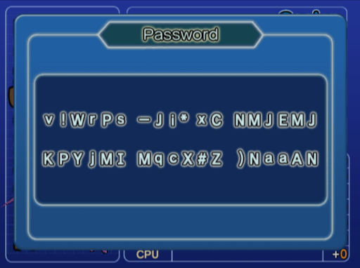
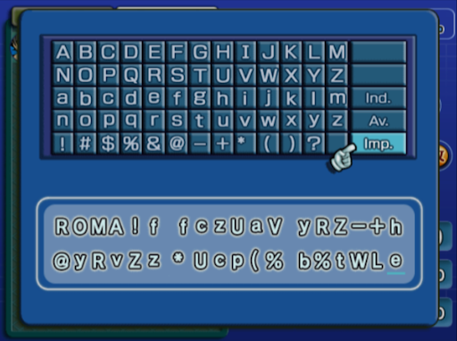
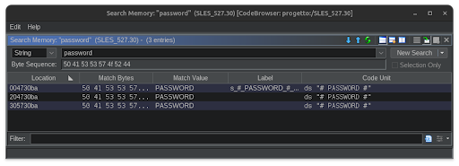
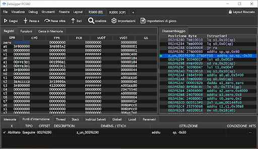
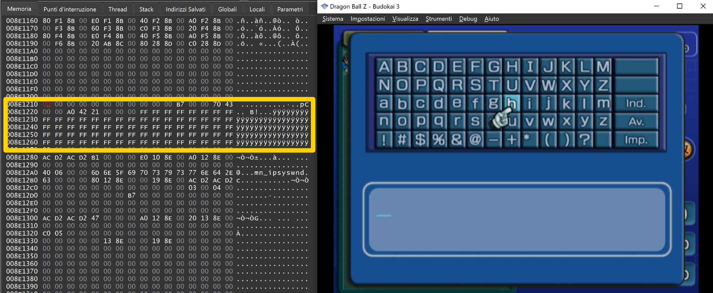
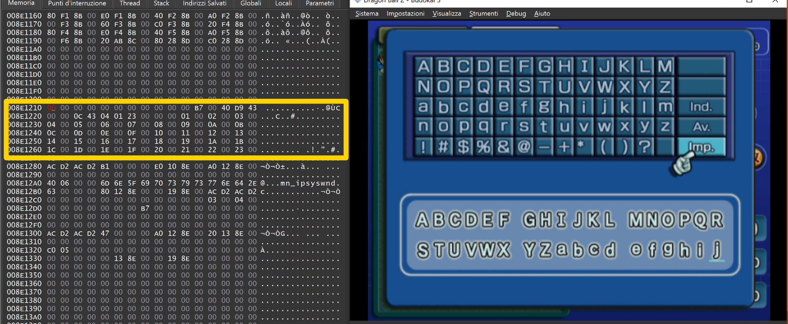
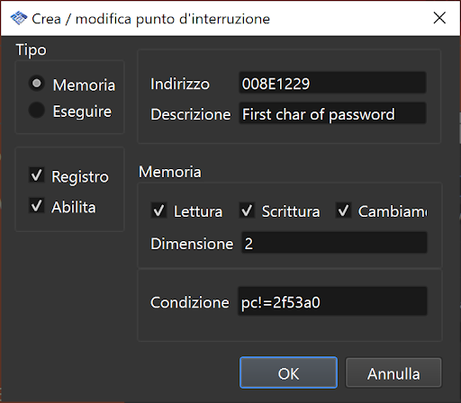
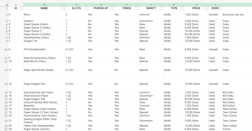
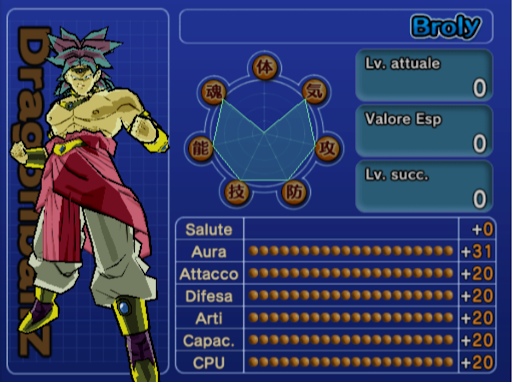
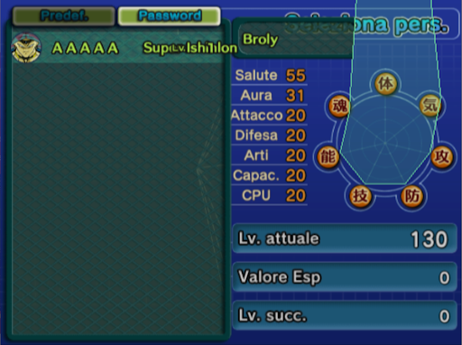

+++
date = '2026-05-09'
draft = true
title = 'Dragonball Z Budokai 3 - 22 years old password algorithm finally reversed'
tags = ["reverse engineering", "playstation 2", "MIPS"]
+++


Dragon Ball Z Budokai 3 is a PlayStation 2 video game released in 2004. The best Dragon Ball game ever, if you ask me :)

After spending countless hours playing it as a kid, and after recently replaying it again, I decided to reverse engineer the game to understand how the character password mechanic works.

The goal of this little project is to understand how the game turns a password into a character, and how it validates it.

Let's begin!

## TL;DR
I have reverse engineered the algorithm that generates the passwords and I can generate passwords for arbitrary characters. It is also possible to generate characters with "infinite" health by exploiting an integer underflow. If you want to generate a custom character to play against, try this site: [DBZ3-Passwords-Generator](https://lucapalumbo.github.io/DBZB3-Passwords-Generator)


*Figure: Dragon Ball Z Budokai 3 game screenshot*

## Game Features
The game implements an RPG mechanic, where each character can level up and improve their stats. 

There are 7 character stats:
- Health (how much health the character has)
- Ki (ki recharge speed)
- Attack (how much damage the character deals)
- Defense (how resistant the character is)
- Arts (additional damage from special moves)
- Ability (to enhance the effects of special items)
- CPU (how smart the character is when controlled by the CPU)

Each character can then be assigned 'capsules', which are the special moves / items that the character can use during fights.

The cool thing is that every time a character levels up, the game generates a password that encodes the character's information: level, stats, capsules.

This password can be shared with a friend, who can enter it into their game and then play against our computer-controlled character.
A curious and original multiplayer interaction mechanic without the need for the internet.




*Figures: Screenshot of an example password and the password input window*

Below I describe how to identify the function that validates the password starting from the game's ISO.


> Note: What I am about to describe is not exactly the process I followed to reverse the game. My first approach was much more confused and messy: I wandered around the codebase for a long time and placed numerous breakpoints before finding the most interesting functions. 

## Reversing 
The first thing to do is download an emulator (PCSX2) and get an ISO of the game*. An iso file is just a digital copy of an optical disc's contents. It is essentially an archive extractable with tools like 7zip.


Once the archive is extracted, we get numerous files and folders, most of these are game assets (music, images, sounds...). The `SLES_527.30` file is an ELF, the logical core of the game, so the natural candidate to start from. It's a binary compiled for the Emotion Engine, a proprietary Sony and Toshiba processor based on MIPS.


> Note: if you want to step-by-step debug Emotion Engine assembly code, I recommend familiarizing yourself with the concept of the [Delay Slot](https://en.wikipedia.org/wiki/Delay_slot).


What we can do is open this binary in Ghidra.

> Note: Ghidra supports the MIPS architecture by default, however it does not support the Emotion Engine variant. To make Ghidra work correctly with the game there is a Ghidra extension: [Emotion Engine Reloaded](https://github.com/chaoticgd/ghidra-emotionengine-reloaded).


When reversing, you have to keep in mind that strings in a binary are a fundamental help. So the first thing to do is check if there are any strings containing the word "password". In fact, there are three different ones. Obviously, we are interested in understanding which functions have references to these strings.




We discover that two of these strings have no references, while one is used by only one function. Understanding what this function does is not exactly easy. So an idea is to put a breakpoint on this function and try to hit it with the emulator.

```c++
undefined8 reference_to_password_string(void)

{
  undefined8 uVar1;
  int iVar2;
  int global_ptr;
  
  global_ptr = iGpffff8c8c;
  uVar1 = FUN_00144fc0(0x2f5f00,0,0x4000,8,2,0x4730b8);
  *(int *)(global_ptr + 0x18) = (int)uVar1;
  global_ptr = FUN_0013aab0(0x174,0,0x4730c8,0xb1);
  *(int *)((int)uVar1 + 0x30) = global_ptr;
  FUN_001258f8(global_ptr,0,0x174);
  *(undefined4 *)(global_ptr + 0x11c) = 0x43700000;
  iVar2 = 0;
  *(undefined4 *)(global_ptr + 0x120) = 0x42a00000;
  do {
    *(undefined2 *)(global_ptr + 0x128) = 0xffff;
    *(undefined2 *)(global_ptr + 0x12a) = 0xffff;
    iVar2 = iVar2 + 6;
    *(undefined2 *)(global_ptr + 300) = 0xffff;
    *(undefined2 *)(global_ptr + 0x12e) = 0xffff;
    *(undefined2 *)(global_ptr + 0x130) = 0xffff;
    *(undefined2 *)(global_ptr + 0x132) = 0xffff;
    global_ptr = global_ptr + 0xc;
  } while (iVar2 < 0x24);
  return uVar1;
}

```
*The decompilation of this function doesn't seem to be very accurate, but we'll make do with it*




By doing this we discover that this function is called as soon as we try to open the keyboard to enter the password. So we can assume it's an initialization function for the password input window.


Analyzing this function in a bit more detail, we notice it writes the value `0xffff` into a buffer of 36 shorts. Who knows what this buffer represents.
The idea at this point is to use dynamic analysis once again: we observe the memory area using the debugger and start manually entering the password in the game to see what happens. 





What we discover is that this memory buffer contains the password we type. The 36-short buffer corresponds to the 36 characters of the password entered on the screen. This gives us 2 essential pieces of information:
- the characters are encoded in shorts and the encoding is very simple: 'A' = 0, 'B' = 1, ...
- we now know the address where the entered password is saved


The next step is definitely to understand how this entered password is used. We want to find a function that reads these bytes and uses them in some way. So we rely on memory breakpoints (yes, the PCSX2 debugger even has memory breakpoints). 

>A memory breakpoint is a type of breakpoint that is triggered when a certain memory address is read/written. In an emulator, they are certainly implemented differently, but these types of breakpoints also exist in modern architectures and are implemented via specific hardware registers.



*Note that I added a condition: program counter different from 0x2f53a0. This is because at that address there is an instruction that reads the buffer in question on every frame of the game. It is probably a function that manages the graphics of the window, so it is not interesting and is only annoying*


Using memory breakpoints we are able to identify 2 points where a read is performed from that buffer.
At one of these points we observe a copy from the global password buffer to another local buffer on the stack. Then this buffer is passed to another function as an argument.

```c++
void FUN_002f4920(int param_1)

{
  int iVar1;
  undefined4 uVar2;
  long lVar3;
  character_struct *ptr_char_struct;
  int iVar4;
  int iVar5;
  character_struct char_struct_array [3];
  
  iVar5 = 0;
  iVar1 = *(int *)(param_1 + 0x30);
  ptr_char_struct = char_struct_array;
  iVar4 = iVar1;
  do {
    iVar5 = iVar5 + 6;
    ptr_char_struct[1].char_id = *(short *)(iVar4 + 0x128);
    ptr_char_struct[1].level = *(short *)(iVar4 + 0x12a);
    ptr_char_struct[1].stats[0] = *(short *)(iVar4 + 300);
    ptr_char_struct[1].stats[1] = *(short *)(iVar4 + 0x12e);
    ptr_char_struct[1].stats[2] = *(short *)(iVar4 + 0x130);
    ptr_char_struct[1].stats[3] = *(short *)(iVar4 + 0x132);
    iVar4 = iVar4 + 0xc;
    ptr_char_struct = (character_struct *)(ptr_char_struct->stats + 4);
  } while (iVar5 < 0x24);
  lVar3 = decode_password(char_struct_array);
```

This called function is exactly the function we are looking for: it's the password decoding routine!

## Algorithm description
The algorithm is divided into 3 distinct steps.

```c++
void decode_password(character_struct *character)
{
  undefined1 buffer [32];
  
  stage1(buffer,&character->char_id);
  stage2(buffer);
  stage3(character,buffer);
  return;
}
```

The first one does not decode the password data, but repackages it into a more compact array. Every character, as we said, is encoded by a short, and the possible characters are 64. This means that only 6 bits are truly important, the others will be 0. What this stage does is therefore remove the useless bits and concatenate the bits carrying information. This results in a 27-byte buffer.


<details markdown="1">
<summary>Stage 1</summary>

```c++
void stage1(byte *buffer,short *password)
{
  *buffer = (byte)((int)password[0x10] << 2);
  *buffer = *buffer | (byte)(password[0x11] >> 4) & 3;
  buffer[1] = (byte)((int)password[0x11] << 4);
  buffer[1] = buffer[1] | (byte)(password[0x12] >> 2) & 0xf;
  buffer[2] = (byte)((int)password[0x12] << 6);
  buffer[2] = buffer[2] | (byte)password[0x13] & 0x3f;
  buffer[3] = (byte)((int)password[0x14] << 2);
  buffer[3] = buffer[3] | (byte)(password[0x15] >> 4) & 3;
  buffer[4] = (byte)((int)password[0x15] << 4);
  buffer[4] = buffer[4] | (byte)(password[0x16] >> 2) & 0xf;
  buffer[5] = (byte)((int)password[0x16] << 6);
  buffer[5] = buffer[5] | (byte)password[0x17] & 0x3f;
  buffer[6] = (byte)((int)password[0x18] << 2);
  buffer[6] = buffer[6] | (byte)(password[0x19] >> 4) & 3;
  buffer[7] = (byte)((int)password[0x19] << 4);
  buffer[7] = buffer[7] | (byte)(password[0x1a] >> 2) & 0xf;
  buffer[8] = (byte)((int)password[0x1a] << 6);
  buffer[8] = buffer[8] | (byte)password[0x1b] & 0x3f;
  buffer[9] = (byte)((int)password[0x1c] << 2);
  buffer[9] = buffer[9] | (byte)(password[0x1d] >> 4) & 3;
  buffer[10] = (byte)((int)password[0x1d] << 4);
  buffer[10] = buffer[10] | (byte)(password[0x1e] >> 2) & 0xf;
  buffer[0xb] = (byte)((int)password[0x1e] << 6);
  buffer[0xb] = buffer[0xb] | (byte)password[0x1f] & 0x3f;
  buffer[0xc] = (byte)((int)password[0x20] << 2);
  buffer[0xc] = buffer[0xc] | (byte)(password[0x21] >> 4) & 3;
  buffer[0xd] = (byte)((int)password[0x21] << 4);
  buffer[0xd] = buffer[0xd] | (byte)(password[0x22] >> 2) & 0xf;
  buffer[0xe] = (byte)((int)password[0x22] << 6);
  buffer[0xe] = buffer[0xe] | (byte)password[0x23] & 0x3f;
  buffer[0xf] = (byte)((int)password[0x24] << 2);
  buffer[0xf] = buffer[0xf] | (byte)(password[0x25] >> 4) & 3;
  buffer[0x10] = (byte)((int)password[0x25] << 4);
  buffer[0x10] = buffer[0x10] | (byte)(password[0x26] >> 2) & 0xf;
  buffer[0x11] = (byte)((int)password[0x26] << 6);
  buffer[0x11] = buffer[0x11] | (byte)password[0x27] & 0x3f;
  buffer[0x12] = (byte)((int)password[0x28] << 2);
  buffer[0x12] = buffer[0x12] | (byte)(password[0x29] >> 4) & 3;
  buffer[0x13] = (byte)((int)password[0x29] << 4);
  buffer[0x13] = buffer[0x13] | (byte)(password[0x2a] >> 2) & 0xf;
  buffer[0x14] = (byte)((int)password[0x2a] << 6);
  buffer[0x14] = buffer[0x14] | (byte)password[0x2b] & 0x3f;
  buffer[0x15] = (byte)((int)password[0x2c] << 2);
  buffer[0x15] = buffer[0x15] | (byte)(password[0x2d] >> 4) & 3;
  buffer[0x16] = (byte)((int)password[0x2d] << 4);
  buffer[0x16] = buffer[0x16] | (byte)(password[0x2e] >> 2) & 0xf;
  buffer[0x17] = (byte)((int)password[0x2e] << 6);
  buffer[0x17] = buffer[0x17] | (byte)password[0x2f] & 0x3f;
  buffer[0x18] = (byte)((int)password[0x30] << 2);
  buffer[0x18] = buffer[0x18] | (byte)(password[0x31] >> 4) & 3;
  buffer[0x19] = (byte)((int)password[0x31] << 4);
  buffer[0x19] = buffer[0x19] | (byte)(password[0x32] >> 2) & 0xf;
  buffer[0x1a] = (byte)((int)password[0x32] << 6);
  buffer[0x1a] = buffer[0x1a] | (byte)password[0x33] & 0x3f;
  return;
}
```

</details>


Step 2 does not change the informational content, but scrambles the bytes according to a permutation. This step uses a key that determines what the actual permutation will be: the key is given by the first 4 bytes (the key will not be permuted)


<details markdown="1">
<summary>Stage 2</summary>

```c++
void stage2(byte *code)
{
  int iVar1;
  int iVar2;
  long lVar3;
  long lVar4;
  long lVar5;
  byte abStack_20 [32];
  byte k0;
  byte k1;
  byte k2;
  byte k3;
  
  lVar5 = 2;
  k2 = code[2];
  k0 = *code;
  k1 = code[1];
  k3 = code[3];
  do {
    lVar4 = 0;
    iVar1 = 0x1b - (int)lVar5;
    if (0 < lVar5) {
      if (8 < lVar5) {
        do {
          iVar2 = (int)lVar4;
          abStack_20[iVar2] = code[iVar2 + iVar1];
          code[iVar2 + iVar1] = 0;
          abStack_20[iVar2 + 1] = code[iVar2 + 1 + iVar1];
          code[iVar2 + 1 + iVar1] = 0;
          abStack_20[iVar2 + 2] = code[iVar2 + 2 + iVar1];
          code[iVar2 + 2 + iVar1] = 0;
          lVar4 = lVar4 + 8;
          abStack_20[iVar2 + 3] = code[iVar2 + 3 + iVar1];
          code[iVar2 + 3 + iVar1] = 0;
          abStack_20[iVar2 + 4] = code[iVar2 + 4 + iVar1];
          code[iVar2 + 4 + iVar1] = 0;
          abStack_20[iVar2 + 5] = code[iVar2 + 5 + iVar1];
          code[iVar2 + 5 + iVar1] = 0;
          abStack_20[iVar2 + 6] = code[iVar2 + 6 + iVar1];
          code[iVar2 + 6 + iVar1] = 0;
          abStack_20[iVar2 + 7] = code[iVar2 + 7 + iVar1];
          code[iVar2 + 7 + iVar1] = 0;
        } while (lVar4 < lVar5 + -8);
      }
      for (; lVar4 < lVar5; lVar4 = lVar4 + 1) {
        abStack_20[(int)lVar4] = code[(int)lVar4 + iVar1];
        code[(int)lVar4 + iVar1] = 0;
      }
    }
    lVar4 = FUN_00120a00((ulong)k3 | (ulong)k2 << 8 | (ulong)k0 << 0x18 | (ulong)k1 << 0x10,lVar5);
    lVar3 = 0;
    if (0 < lVar5) {
      do {
        iVar2 = (int)(lVar4 + lVar3);
        if (lVar4 + lVar3 < lVar5) {
          code[iVar1 + (int)lVar3] = abStack_20[iVar2];
        }
        else {
          code[iVar1 + (int)lVar3] = abStack_20[iVar2 - (int)lVar5];
        }
        lVar3 = lVar3 + 1;
      } while (lVar3 < lVar5);
    }
    lVar5 = lVar5 + 1;
  } while (lVar5 < 0x18);
  return;
}
```
</details>

The last step reconstructs the character's information (level, stats, capsules) by recombining the individual bits in specific positions of the buffer permuted by the previous step. 
This step also checks that the password is internally consistent through checksums and bit parity. 
The checksum check is peculiar, in fact it checks that the recombination of some bits of the password exactly generates its first 4 bytes. However, the bits used for this integrity check are additional bits, which carry no information about the character described by the password we are decoding.

<details markdown="1">
<summary>Stage 3</summary>

```c++
undefined4 stage3(character_struct *character_struct,byte *code)
{
  short level;
  undefined4 uVar1;
  long next_i;
  uint checksum;
  ulong bit_counter;
  long i;
  short capsule [8];
  byte code_0x10;
  byte code_0x11;
  byte code_0x12;
  byte code_0x13;
  byte code_0x14;
  byte code_0x15;
  byte code_0x16;
  byte code_0x17;
  byte code_0x18;
  byte code_0x19;
  byte code_0x1a;
  byte code_0xc;
  byte code_0xd;
  byte code_0xe;
  byte code_0xf;
  byte code_10;
  byte code_11;
  byte code_4;
  byte code_5;
  byte code_6;
  byte code_7;
  byte code_8;
  byte code_9;
  short stat_0;
  ushort stat_1;
  short stat_2;
  short stat_3;
  short stat_4;
  short stat_5;
  short stat_6;
  
  code_4 = code[4];
  code_0xd = code[0xd];
  code_5 = code[5];
  code_6 = code[6];
  code_7 = code[7];
  checksum = (uint)code[3] | (uint)code[2] << 8 | (uint)*code << 0x18 | (uint)code[1] << 0x10;
  code_8 = code[8];
  code_9 = code[9];
  code_10 = code[10];
  code_11 = code[0xb];
  code_0xc = code[0xc];
  stat_1 = code_8 >> 1 & 1 |
           (code_8 >> 2 & 1) << 1 |
           (code_8 >> 4 & 1) << 2 | (ushort)(code_8 >> 7) << 4 | (code_8 >> 6 & 1) << 3;
  code_0xe = code[0xe];
  code_0xf = code[0xf];
  code_0x10 = code[0x10];
  code_0x11 = code[0x11];
  code_0x12 = code[0x12];
  code_0x13 = code[0x13];
  code_0x14 = code[0x14];
  code_0x15 = code[0x15];
  code_0x16 = code[0x16];
  code_0x18 = code[0x18];
  code_0x17 = code[0x17];
  code_0x19 = code[0x19];
  code_0x1a = code[0x1a];
  if (checksum ==
      ~((code_5 >> 6 & 1) << 0x1b |
        (code_4 & 1) << 0x1c |
        (code_4 >> 2 & 1) << 0x1d | (uint)(code_4 >> 6) << 0x1f | (code_4 >> 4 & 1) << 0x1e |
        (code_6 & 1) << 0x16 |
        (code_6 >> 2 & 1) << 0x17 |
        (code_6 >> 5 & 1) << 0x18 | (code_5 >> 3 & 1) << 0x1a | (code_5 & 1) << 0x19 |
        (code_7 >> 1 & 1) << 0x13 | (uint)(code_7 >> 7) << 0x15 | (code_7 >> 4 & 1) << 0x14 |
        (code_8 & 1) << 0x10 | (code_8 >> 5 & 1) << 0x12 | (code_8 >> 3 & 1) << 0x11 |
        (code_9 >> 2 & 1) << 0xd | (code_9 >> 6 & 1) << 0xf | (code_9 >> 5 & 1) << 0xe |
        (code_10 >> 1 & 1) << 10 | (uint)(code_10 >> 7) << 0xc | (code_10 >> 4 & 1) << 0xb |
        (code_11 & 1) << 7 | (code_11 >> 6 & 1) << 9 | (code_11 >> 3 & 1) << 8 |
        (code_0xc >> 2 & 1) << 4 | (uint)(code_0xc >> 7) << 6 | (code_0xc >> 5 & 1) << 5 |
        (code_0xd >> 1 & 1) << 1 | (uint)(code_0xd >> 7) << 3 | (code_0xd >> 4 & 1) << 2 |
       code_0xe >> 5 & 1)) {
    uVar1 = 0xffffffff;
    if (checksum ==
        ~((code_0xf >> 4 & 1) << 0x1d |
          (uint)(code_0xe >> 2) << 0x1f | (uint)(code_0xf >> 7) << 0x1e |
          (code_0x11 >> 6 & 1) << 0x19 |
          (code_0x10 >> 2 & 1) << 0x1a | (code_0xf >> 1 & 1) << 0x1c | (code_0x10 >> 6 & 1) << 0x1b
          | (code_0x13 >> 6 & 1) << 0x15 |
            (code_0x12 >> 2 & 1) << 0x16 |
            (code_0x11 >> 2 & 1) << 0x18 | (code_0x12 >> 6 & 1) << 0x17 |
          (code_0x14 >> 1 & 1) << 0x11 |
          (code_0x14 >> 4 & 1) << 0x12 |
          (code_0x13 >> 2 & 1) << 0x14 | (uint)(code_0x14 >> 7) << 0x13 |
          (code_0x16 >> 4 & 1) << 0xd |
          (uint)(code_0x16 >> 7) << 0xe | (code_0x15 >> 5 & 1) << 0x10 | (code_0x15 >> 2 & 1) << 0xf
          | (code_0x18 >> 6 & 1) << 9 |
            (code_0x17 >> 2 & 1) << 10 | (code_0x16 >> 1 & 1) << 0xc | (code_0x17 >> 6 & 1) << 0xb |
         code_0x1a >> 1 & 1 |
         (code_0x1a >> 2 & 1) << 1 |
         (code_0x1a >> 3 & 1) << 2 |
         (code_0x1a >> 4 & 1) << 3 |
         (code_0x1a >> 5 & 1) << 4 |
         (code_0x19 >> 1 & 1) << 5 |
         (code_0x19 >> 5 & 1) << 6 | (code_0x18 >> 3 & 1) << 8 | (code_0x18 & 1) << 7)) {
      bit_counter = 0;
      i = 0;
      do {
        next_i = i + 1;
        code_8 = code[(int)i];
        checksum = (uint)code_8;
        bit_counter = bit_counter + (long)(int)(code_8 & 1) +
                      (long)(int)((int)(uint)code_8 >> 1 & 1) +
                      (long)(int)((int)(uint)code_8 >> 2 & 1) + (long)(int)((int)checksum >> 3 & 1)
                      + (long)(int)((int)checksum >> 4 & 1) + (long)(int)((int)checksum >> 5 & 1) +
                      (long)(int)((int)checksum >> 6 & 1) + (long)((int)(uint)code_8 >> 7);
        i = next_i;
      } while (next_i < 0x1b);
      uVar1 = 0xffffffff;
      if ((bit_counter & 1) == 0) {
        stat_0 = (code_7 & 1 |
                 (code_7 >> 2 & 1) << 1 |
                 (code_7 >> 3 & 1) << 2 | (code_7 >> 6 & 1) << 4 | (code_7 >> 5 & 1) << 3) - 7;
        stat_2 = (code_9 & 1 |
                 (code_9 >> 1 & 1) << 1 |
                 (code_9 >> 3 & 1) << 2 | (ushort)(code_9 >> 7) << 4 | (code_9 >> 4 & 1) << 3) - 7;
        capsule[0] = (code_0xf >> 2 & 1 |
                     (code_0xf >> 3 & 1) << 1 |
                     (code_0xf >> 5 & 1) << 2 |
                     (code_0xf >> 6 & 1) << 3 |
                     (code_0xe & 1) << 4 |
                     (code_0xe >> 1 & 1) << 5 |
                     (code_0xe >> 3 & 1) << 6 |
                     (code_0xe >> 4 & 1) << 7 |
                     (ushort)(code_0xe >> 7) << 9 | (code_0xe >> 6 & 1) << 8) - 300;
        stat_3 = (code_10 & 1 |
                 (code_10 >> 2 & 1) << 1 |
                 (code_10 >> 3 & 1) << 2 | (code_10 >> 6 & 1) << 4 | (code_10 >> 5 & 1) << 3) - 7;
        stat_4 = (code_11 >> 1 & 1 |
                 (code_11 >> 2 & 1) << 1 |
                 (code_11 >> 4 & 1) << 2 | (ushort)(code_11 >> 7) << 4 | (code_11 >> 5 & 1) << 3) -
                 7;
        stat_5 = (code_0xc & 1 |
                 (code_0xc >> 1 & 1) << 1 |
                 (code_0xc >> 3 & 1) << 2 | (code_0xc >> 6 & 1) << 4 | (code_0xc >> 4 & 1) << 3) - 7
        ;
        stat_6 = (code_0xd & 1 |
                 (code_0xd >> 2 & 1) << 1 |
                 (code_0xd >> 3 & 1) << 2 | (code_0xd >> 6 & 1) << 4 | (code_0xd >> 5 & 1) << 3) - 7
        ;
        level = (code_6 >> 1 & 1 |
                (code_6 >> 3 & 1) << 1 |
                (code_6 >> 4 & 1) << 2 |
                (code_6 >> 6 & 1) << 3 |
                (ushort)(code_6 >> 7) << 4 |
                (code_5 >> 1 & 1) << 5 | (code_5 >> 4 & 1) << 7 | (code_5 >> 2 & 1) << 6) - 7;
        capsule[1] = (code_0x11 >> 4 & 1 |
                     (code_0x11 >> 5 & 1) << 1 |
                     (ushort)(code_0x11 >> 7) << 2 |
                     (code_0x10 & 1) << 3 |
                     (code_0x10 >> 1 & 1) << 4 |
                     (code_0x10 >> 3 & 1) << 5 |
                     (code_0x10 >> 4 & 1) << 6 |
                     (code_0x10 >> 5 & 1) << 7 | (code_0xf & 1) << 9 | (ushort)(code_0x10 >> 7) << 8
                     ) - 300;
        capsule[2] = ((ushort)(code_0x13 >> 7) |
                     (code_0x12 & 1) << 1 |
                     (code_0x12 >> 1 & 1) << 2 |
                     (code_0x12 >> 3 & 1) << 3 |
                     (code_0x12 >> 4 & 1) << 4 |
                     (code_0x12 >> 5 & 1) << 5 |
                     (ushort)(code_0x12 >> 7) << 6 |
                     (code_0x11 & 1) << 7 | (code_0x11 >> 3 & 1) << 9 | (code_0x11 >> 1 & 1) << 8) -
                     300;
        capsule[3] = (code_0x14 & 1 |
                     (code_0x14 >> 2 & 1) << 1 |
                     (code_0x14 >> 3 & 1) << 2 |
                     (code_0x14 >> 5 & 1) << 3 |
                     (code_0x14 >> 6 & 1) << 4 |
                     (code_0x13 & 1) << 5 |
                     (code_0x13 >> 1 & 1) << 6 |
                     (code_0x13 >> 3 & 1) << 7 |
                     (code_0x13 >> 5 & 1) << 9 | (code_0x13 >> 4 & 1) << 8) - 300;
        capsule[4] = (code_0x16 >> 2 & 1 |
                     (code_0x16 >> 3 & 1) << 1 |
                     (code_0x16 >> 5 & 1) << 2 |
                     (code_0x16 >> 6 & 1) << 3 |
                     (code_0x15 & 1) << 4 |
                     (code_0x15 >> 1 & 1) << 5 |
                     (code_0x15 >> 3 & 1) << 6 |
                     (code_0x15 >> 4 & 1) << 7 |
                     (ushort)(code_0x15 >> 7) << 9 | (code_0x15 >> 6 & 1) << 8) - 300;
        capsule[5] = (code_0x18 >> 4 & 1 |
                     (code_0x18 >> 5 & 1) << 1 |
                     (ushort)(code_0x18 >> 7) << 2 |
                     (code_0x17 & 1) << 3 |
                     (code_0x17 >> 1 & 1) << 4 |
                     (code_0x17 >> 3 & 1) << 5 |
                     (code_0x17 >> 4 & 1) << 6 |
                     (code_0x17 >> 5 & 1) << 7 |
                     (code_0x16 & 1) << 9 | (ushort)(code_0x17 >> 7) << 8) - 300;
        capsule[6] = (code_0x1a >> 6 & 1 |
                     (ushort)(code_0x1a >> 7) << 1 |
                     (code_0x19 & 1) << 2 |
                     (code_0x19 >> 2 & 1) << 3 |
                     (code_0x19 >> 3 & 1) << 4 |
                     (code_0x19 >> 4 & 1) << 5 |
                     (code_0x19 >> 6 & 1) << 6 |
                     (ushort)(code_0x19 >> 7) << 7 |
                     (code_0x18 >> 2 & 1) << 9 | (code_0x18 >> 1 & 1) << 8) - 300;
        if ((long)level ==
            (long)((int)stat_6 +
                  (int)stat_5 +
                  (int)stat_4 + (int)stat_3 + (int)stat_2 + (int)stat_0 + (int)(short)stat_1)) {
          i = 0;
          do {
            if ((capsule[(int)i] != 0x3ff) && (0x254 < capsule[(int)i])) {
              return 0xffffffff;
            }
            i = i + 1;
          } while (i < 7);
          uVar1 = 0;
          character_struct->char_id =
               (code_5 >> 5 & 1 |
               (ushort)(code_5 >> 7) << 1 |
               (code_4 >> 1 & 1) << 2 |
               (code_4 >> 3 & 1) << 3 | (ushort)(code_4 >> 7) << 5 | (code_4 >> 5 & 1) << 4) - 7;
          character_struct->level = level;
          character_struct->stats[0] = stat_0;
          character_struct->stats[1] = stat_1;
          character_struct->stats[2] = stat_2;
          character_struct->stats[3] = stat_3;
          character_struct->stats[4] = stat_4;
          character_struct->stats[5] = stat_5;
          character_struct->stats[6] = stat_6;
          character_struct->capsule[0] = capsule[0];
          character_struct->capsule[1] = capsule[1];
          character_struct->capsule[2] = capsule[2];
          character_struct->capsule[3] = capsule[3];
          character_struct->capsule[4] = capsule[4];
          character_struct->capsule[5] = capsule[5];
          character_struct->capsule[6] = capsule[6];
        }
        else {
          uVar1 = 0xffffffff;
        }
      }
    }
  }
  else {
    uVar1 = 0xffffffff;
  }
  return uVar1;
}
```
</details>


> Note: You can see that the stat values are obtained by recombining the buffer bits and then subtracting 7 (with the exception of the Ki stat). This `-7` will come in handy later.


Alright, so now can we reverse the algorithm and generate arbitrary characters? Not quite yet, because to generate a character, let's say Broly, we need to know Broly's character_id, and to assign him the right capsules we need to know the correct capsule_ids.
Where can we find all these numeric IDs now?


## Finding the IDs
There are many ways to find the IDs, both for characters and capsules. For example, let's say I want to find Broly's ID: I can generate a base character with character_id = 0, lv = 1, stats = [1,0,0,0,0,0,0] and capsules = [-1,-1,-1,-1,-1,-1] (-1 means no capsule). By entering this password I would discover that ID 0 corresponds to Goku, so I proceed to generate the password changing only the character_id to 1, and so on. This is a slow process, because it involves manually entering all passwords, but there are only about 40 characters, so it's definitely feasible. This is indeed the strategy I used to enumerate all (id, character) pairs.

The problem arises when I want to bruteforce the capsules. It's not as simple because the game doesn't tell you what capsules the character of the password you just entered has. The only way, as far as I know, to understand if the capsule you assigned is the right one is to play against the character and see if the computer uses that capsule during the fight. So it takes much longer, plus the game's capsules are much more numerous, in the order of 500.

What we can do is therefore try to reverse the game more deeply. The information about these IDs will be found somewhere, probably in the game assets.

The much lazier strategy I adopted is instead very different: I knew that this game has some very active modding communities. 


*Example of a mod made by the community*

After several searches I managed to get into the Discord server of one of these communities, I then asked them to tell me where to find this list of capsules, and they sent me a very convenient spreadsheet with all the information I was looking for. :)




## Arbitrary Character Generation

We are now finally able to generate characters however we like with a python script like this: 

<details markdown="1">
<summary>reversed.py</summary>

```python
from typing import List

DICTIONARY = [
    'A','B','C','D','E','F','G','H','I','J','K','L','M',
    'N','O','P','Q','R','S','T','U','V','W','X','Y','Z',
    'a','b','c','d','e','f','g','h','i','j','k','l','m',
    'n','o','p','q','r','s','t','u','v','w','x','y','z',
    '!','#','$','%','&','@','-','+','*','(',')','?'
]


CHARACTERS_ID = [
    "GOKU", "KID GOKU", "KID GOHAN", "TEEN GOHAN", "ADULT GOHAN", "GREAT SAIYAMA", "GOTEN", "VEGETA", "FUTURE TRUNKS", "KID TRUNKS", "KRILLIN", "PICCOLO", "TIEN SHINHAN", "YAMCHA", "HERCULE SATAN", "VIDEL", "KAIOSHIN", "UUB", "RADITZ", "NAPPA", "GINYU", "RECOOME", "FRIEZA", "ANDROID 16", "ANDROID 17", "ANDROID 18", "DR. GERO", "CELL", "MAJIN BUU", "SUPER BUU", "KID BUU", "DABURA", "COOLER", "BARDOCK", "BROLY", "OMEGA SHENRON", "SAIBAMEN", "CELL JR."
]

def set_bit(output, position, bit, value):
    # set output[idx] at bit position to value (0 or 1)
    if value:
        output[position] |= (1 << bit)
    else:
        output[position] &= ~(1 << bit)

def set_byte(output, position, value):
    output[position] = value & 0xFF


def step3_inverse(character, checksum = 0xffffffff):
    output = [0]*27

    id_byte = character['character_id'] + 7 
    set_bit(output, 5, 5, id_byte & 1)
    set_bit(output, 5, 7, (id_byte >> 1) & 1)
    set_bit(output, 4, 1, (id_byte >> 2) & 1)
    set_bit(output, 4, 3, (id_byte >> 3) & 1)
    set_bit(output, 4, 5, (id_byte >> 4) & 1)
    set_bit(output, 4, 7, (id_byte >> 5) & 1)


    # # Level (8 bits, composite)
    # level = (
    #     ((b[6] >> 1) & 1) << 0 |
    #     ((b[6] >> 3) & 1) << 1 |
    #     ((b[6] >> 4) & 1) << 2 |
    #     ((b[6] >> 6) & 1) << 3 |
    #     ((b[6] >> 7) & 1) << 4 |
    #     ((b[5] >> 1) & 1) << 5 |
    #     ((b[5] >> 4) & 1) << 7 |
    #     ((b[5] >> 2) & 1) << 6
    # ) - 7
    level_byte = character['level'] + 7
    set_bit(output, 6, 1, level_byte & 1)
    set_bit(output, 6, 3, (level_byte >> 1) & 1)
    set_bit(output, 6, 4, (level_byte >> 2) & 1)
    set_bit(output, 6, 6, (level_byte >> 3) & 1)
    set_bit(output, 6, 7, (level_byte >> 4) & 1)
    set_bit(output, 5, 1, (level_byte >> 5) & 1)
    set_bit(output, 5, 2, (level_byte >> 6) & 1)
    set_bit(output, 5, 4, (level_byte >> 7) & 1)


    # stat0 = (
    #     ((b[7] >> 0) & 1) << 0 |
    #     ((b[7] >> 2) & 1) << 1 |
    #     ((b[7] >> 3) & 1) << 2 |
    #     ((b[7] >> 6) & 1) << 4 |
    #     ((b[7] >> 5) & 1) << 3
    # ) - 7
    stat_byte = character['stats'][0] + 7
    set_bit(output, 7, 0, stat_byte & 1)
    set_bit(output, 7, 2, (stat_byte >> 1) & 1)
    set_bit(output, 7, 3, (stat_byte >> 2) & 1)
    set_bit(output, 7, 5, (stat_byte >> 3) & 1)
    set_bit(output, 7, 6, (stat_byte >> 4) & 1)


    # stat1 = (
    #     ((b[8] >> 1) & 1) << 0 |
    #     ((b[8] >> 2) & 1) << 1 |
    #     ((b[8] >> 4) & 1) << 2 |
    #     ((b[8] >> 7) & 1) << 4 |
    #     ((b[8] >> 6) & 1) << 3
    # ) 
    stat_byte = character['stats'][1]
    set_bit(output, 8, 1, stat_byte & 1)
    set_bit(output, 8, 2, (stat_byte >> 1) & 1)
    set_bit(output, 8, 4, (stat_byte >> 2) & 1)
    set_bit(output, 8, 6, (stat_byte >> 3) & 1)
    set_bit(output, 8, 7, (stat_byte >> 4) & 1)


    # stat2 = (
    #     ((b[9] >> 0) & 1) << 0 |
    #     ((b[9] >> 1) & 1) << 1 |
    #     ((b[9] >> 3) & 1) << 2 |
    #     ((b[9] >> 7) & 1) << 4 |
    #     ((b[9] >> 4) & 1) << 3
    # ) - 7
    stat_byte = character['stats'][2] + 7
    set_bit(output, 9, 0, stat_byte & 1)
    set_bit(output, 9, 1, (stat_byte >> 1) & 1)
    set_bit(output, 9, 3, (stat_byte >> 2) & 1)
    set_bit(output, 9, 4, (stat_byte >> 3) & 1)
    set_bit(output, 9, 7, (stat_byte >> 4) & 1)

    # stat3 = (
    #     ((b[10] >> 0) & 1) << 0 |
    #     ((b[10] >> 2) & 1) << 1 |
    #     ((b[10] >> 3) & 1) << 2 |
    #     ((b[10] >> 6) & 1) << 4 |
    #     ((b[10] >> 5) & 1) << 3
    # ) - 7
    stat_byte = character['stats'][3] + 7
    set_bit(output, 10, 0, stat_byte & 1)
    set_bit(output, 10, 2, (stat_byte >> 1) & 1)
    set_bit(output, 10, 3, (stat_byte >> 2) & 1)
    set_bit(output, 10, 5, (stat_byte >> 3) & 1)
    set_bit(output, 10, 6, (stat_byte >> 4) & 1)

    # stat4 = (
    #     ((b[11] >> 1) & 1) << 0 |
    #     ((b[11] >> 2) & 1) << 1 |
    #     ((b[11] >> 4) & 1) << 2 |
    #     ((b[11] >> 7) & 1) << 4 |
    #     ((b[11] >> 5) & 1) << 3
    # ) - 7
    stat_byte = character['stats'][4] + 7
    set_bit(output, 11, 1, stat_byte & 1)
    set_bit(output, 11, 2, (stat_byte >> 1) & 1)
    set_bit(output, 11, 4, (stat_byte >> 2) & 1)
    set_bit(output, 11, 5, (stat_byte >> 3) & 1)
    set_bit(output, 11, 7, (stat_byte >> 4) & 1)

    # stat5 = (
    #     ((b[0xc] >> 0) & 1) << 0 |
    #     ((b[0xc] >> 1) & 1) << 1 |
    #     ((b[0xc] >> 3) & 1) << 2 |
    #     ((b[0xc] >> 6) & 1) << 4 |
    #     ((b[0xc] >> 4) & 1) << 3
    # ) - 7
    stat_byte = character['stats'][5] + 7
    set_bit(output, 12, 0, stat_byte & 1)
    set_bit(output, 12, 1, (stat_byte >> 1) & 1)
    set_bit(output, 12, 3, (stat_byte >> 2) & 1)
    set_bit(output, 12, 4, (stat_byte >> 3) & 1)
    set_bit(output, 12, 6, (stat_byte >> 4) & 1)

    # stat6 = (
    #     ((b[0xd] >> 0) & 1) << 0 |
    #     ((b[0xd] >> 2) & 1) << 1 |
    #     ((b[0xd] >> 3) & 1) << 2 |
    #     ((b[0xd] >> 6) & 1) << 4 |
    #     ((b[0xd] >> 5) & 1) << 3
    # ) - 7
    stat_byte = character['stats'][6] + 7
    set_bit(output, 13, 0, stat_byte & 1)
    set_bit(output, 13, 2, (stat_byte >> 1) & 1)
    set_bit(output, 13, 3, (stat_byte >> 2) & 1)
    set_bit(output, 13, 5, (stat_byte >> 3) & 1)
    set_bit(output, 13, 6, (stat_byte >> 4) & 1)

    # capsule0 = (
    #     ((b[15] >> 2) & 1) << 0 |
    #     ((b[15] >> 3) & 1) << 1 |
    #     ((b[15] >> 5) & 1) << 2 |
    #     ((b[15] >> 6) & 1) << 3 |
    #     ((b[14] >> 0) & 1) << 4 |   
    #     ((b[14] >> 1) & 1) << 5 |
    #     ((b[14] >> 3) & 1) << 6 |
    #     ((b[14] >> 4) & 1) << 7 |
    #     ((b[14] >> 7) & 1) << 9 |
    #     ((b[14] >> 6) & 1) << 8
    # ) - 300
    capsule_byte = character['capsules'][0] + 300
    set_bit(output, 15, 2, capsule_byte & 1)
    set_bit(output, 15, 3, (capsule_byte >> 1) & 1)
    set_bit(output, 15, 5, (capsule_byte >> 2) & 1)
    set_bit(output, 15, 6, (capsule_byte >> 3) & 1)
    set_bit(output, 14, 0, (capsule_byte >> 4) & 1)
    set_bit(output, 14, 1, (capsule_byte >> 5) & 1)
    set_bit(output, 14, 3, (capsule_byte >> 6) & 1)
    set_bit(output, 14, 4, (capsule_byte >> 7) & 1)
    set_bit(output, 14, 6, (capsule_byte >> 8) & 1)
    set_bit(output, 14, 7, (capsule_byte >> 9) & 1)

    # capsule1 = (
    #     ((b[17] >> 4) & 1) << 0 |
    #     ((b[17] >> 5) & 1) << 1 |
    #     ((b[17] >> 7) & 1) << 2 |
    #     ((b[16] >> 0) & 1) << 3 |
    #     ((b[16] >> 1) & 1) << 4 |
    #     ((b[16] >> 3) & 1) << 5 |
    #     ((b[16] >> 4) & 1) << 6 |
    #     ((b[16] >> 5) & 1) << 7 |
    #     ((b[15] >> 0) & 1) << 9 |
    #     ((b[16] >> 7) & 1) << 8
    # ) - 300
    capsule_byte = character['capsules'][1] + 300
    set_bit(output, 17, 4, capsule_byte & 1)
    set_bit(output, 17, 5, (capsule_byte >> 1) & 1)
    set_bit(output, 17, 7, (capsule_byte >> 2) & 1)
    set_bit(output, 16, 0, (capsule_byte >> 3) & 1)
    set_bit(output, 16, 1, (capsule_byte >> 4) & 1)
    set_bit(output, 16, 3, (capsule_byte >> 5) & 1)
    set_bit(output, 16, 4, (capsule_byte >> 6) & 1)
    set_bit(output, 16, 5, (capsule_byte >> 7) & 1)
    set_bit(output, 16, 7, (capsule_byte >> 8) & 1)
    set_bit(output, 15, 0, (capsule_byte >> 9) & 1)


    # capsule2 = (
    #     ((b[19] >> 7) & 1) << 0 |
    #     ((b[18] >> 0) & 1) << 1 |
    #     ((b[18] >> 1) & 1) << 2 |
    #     ((b[18] >> 3) & 1) << 3 |
    #     ((b[18] >> 4) & 1) << 4 |
    #     ((b[18] >> 5) & 1) << 5 |
    #     ((b[18] >> 7) & 1) << 6 |
    #     ((b[17] >> 0) & 1) << 7 |
    #     ((b[17] >> 3) & 1) << 9 |
    #     ((b[17] >> 1) & 1) << 8
    # ) - 300
    capsule_byte = character['capsules'][2] + 300
    set_bit(output, 19, 7, capsule_byte & 1)
    set_bit(output, 18, 0, (capsule_byte >> 1) & 1)
    set_bit(output, 18, 1, (capsule_byte >> 2) & 1)
    set_bit(output, 18, 3, (capsule_byte >> 3) & 1)
    set_bit(output, 18, 4, (capsule_byte >> 4) & 1)
    set_bit(output, 18, 5, (capsule_byte >> 5) & 1)
    set_bit(output, 18, 7, (capsule_byte >> 6) & 1)
    set_bit(output, 17, 0, (capsule_byte >> 7) & 1)
    set_bit(output, 17, 1, (capsule_byte >> 8) & 1)
    set_bit(output, 17, 3, (capsule_byte >> 9) & 1)


    # capsule3 = (
    #     ((b[20] >> 0) & 1) << 0 |
    #     ((b[20] >> 2) & 1) << 1 |
    #     ((b[20] >> 3) & 1) << 2 |
    #     ((b[20] >> 5) & 1) << 3 |
    #     ((b[20] >> 6) & 1) << 4 |
    #     ((b[19] >> 0) & 1) << 5 |
    #     ((b[19] >> 1) & 1) << 6 |
    #     ((b[19] >> 3) & 1) << 7 |
    #     ((b[19] >> 5) & 1) << 9 |
    #     ((b[19] >> 4) & 1) << 8
    # ) - 300
    capsule_byte = character['capsules'][3] + 300
    set_bit(output, 20, 0, capsule_byte & 1)
    set_bit(output, 20, 2, (capsule_byte >> 1) & 1)
    set_bit(output, 20, 3, (capsule_byte >> 2) & 1)
    set_bit(output, 20, 5, (capsule_byte >> 3) & 1)
    set_bit(output, 20, 6, (capsule_byte >> 4) & 1)
    set_bit(output, 19, 0, (capsule_byte >> 5) & 1)
    set_bit(output, 19, 1, (capsule_byte >> 6) & 1)
    set_bit(output, 19, 3, (capsule_byte >> 7) & 1)
    set_bit(output, 19, 4, (capsule_byte >> 8) & 1)
    set_bit(output, 19, 5, (capsule_byte >> 9) & 1)

    # capsule4 = (
    #     ((b[22] >> 2) & 1) << 0 |
    #     ((b[22] >> 3) & 1) << 1 |
    #     ((b[22] >> 5) & 1) << 2 |
    #     ((b[22] >> 6) & 1) << 3 |
    #     ((b[21] >> 0) & 1) << 4 |
    #     ((b[21] >> 1) & 1) << 5 |
    #     ((b[21] >> 3) & 1) << 6 |
    #     ((b[21] >> 4) & 1) << 7 |
    #     ((b[21] >> 7) & 1) << 9 |
    #     ((b[21] >> 6) & 1) << 8
    # ) - 300
    capsule_byte = character['capsules'][4] + 300
    set_bit(output, 22, 2, capsule_byte & 1)
    set_bit(output, 22, 3, (capsule_byte >> 1) & 1)
    set_bit(output, 22, 5, (capsule_byte >> 2) & 1)
    set_bit(output, 22, 6, (capsule_byte >> 3) & 1)
    set_bit(output, 21, 0, (capsule_byte >> 4) & 1)
    set_bit(output, 21, 1, (capsule_byte >> 5) & 1)
    set_bit(output, 21, 3, (capsule_byte >> 6) & 1)
    set_bit(output, 21, 4, (capsule_byte >> 7) & 1)
    set_bit(output, 21, 6, (capsule_byte >> 8) & 1)
    set_bit(output, 21, 7, (capsule_byte >> 9) & 1)

    # capsule5 = (
    #     ((b[24] >> 4) & 1) << 0 |
    #     ((b[24] >> 5) & 1) << 1 |
    #     ((b[24] >> 7) & 1) << 2 |
    #     ((b[23] >> 0) & 1) << 3 |
    #     ((b[23] >> 1) & 1) << 4 |
    #     ((b[23] >> 3) & 1) << 5 |
    #     ((b[23] >> 4) & 1) << 6 |
    #     ((b[23] >> 5) & 1) << 7 |
    #     ((b[22] >> 0) & 1) << 9 |
    #     ((b[23] >> 7) & 1) << 8
    # ) - 300
    capsule_byte = character['capsules'][5] + 300
    set_bit(output, 24, 4, capsule_byte & 1)
    set_bit(output, 24, 5, (capsule_byte >> 1) & 1)
    set_bit(output, 24, 7, (capsule_byte >> 2) & 1)
    set_bit(output, 23, 0, (capsule_byte >> 3) & 1)
    set_bit(output, 23, 1, (capsule_byte >> 4) & 1)
    set_bit(output, 23, 3, (capsule_byte >> 5) & 1)
    set_bit(output, 23, 4, (capsule_byte >> 6) & 1)
    set_bit(output, 23, 5, (capsule_byte >> 7) & 1)
    set_bit(output, 23, 7, (capsule_byte >> 8) & 1)
    set_bit(output, 22, 0, (capsule_byte >> 9) & 1)

    # capsule6 = (
    #     ((b[26] >> 6) & 1) << 0 |
    #     ((b[26] >> 7) & 1) << 1 |
    #     ((b[25] >> 0) & 1) << 2 |
    #     ((b[25] >> 2) & 1) << 3 |
    #     ((b[25] >> 3) & 1) << 4 |
    #     ((b[25] >> 4) & 1) << 5 |
    #     ((b[25] >> 6) & 1) << 6 |
    #     ((b[25] >> 7) & 1) << 7 |
    #     ((b[24] >> 2) & 1) << 9 |
    #     ((b[24] >> 1) & 1) << 8
    # ) - 300
    capsule_byte = character['capsules'][6] + 300
    set_bit(output, 26, 6, capsule_byte & 1)
    set_bit(output, 26, 7, (capsule_byte >> 1) & 1)
    set_bit(output, 25, 0, (capsule_byte >> 2) & 1)
    set_bit(output, 25, 2, (capsule_byte >> 3) & 1)
    set_bit(output, 25, 3, (capsule_byte >> 4) & 1)
    set_bit(output, 25, 4, (capsule_byte >> 5) & 1)
    set_bit(output, 25, 6, (capsule_byte >> 6) & 1)
    set_bit(output, 25, 7, (capsule_byte >> 7) & 1)
    set_bit(output, 24, 1, (capsule_byte >> 8) & 1)
    set_bit(output, 24, 2, (capsule_byte >> 9) & 1)

    

    

    set_byte(output, 3, checksum & 0xff)
    set_byte(output, 2, (checksum >> 8) & 0xff)
    set_byte(output, 1, (checksum >> 16) & 0xff)
    set_byte(output, 0, (checksum >> 24) & 0xff)

    #   if (checksum ==
    #   ~((code_5 >> 6 & 1) << 0x1b |
    #     (code_4 & 1) << 0x1c |
    #     (code_4 >> 2 & 1) << 0x1d | (uint)(code_4 >> 6) << 0x1f | (code_4 >> 4 & 1) << 0x1e |
    #     (code_6 & 1) << 0x16 |
    #     (code_6 >> 2 & 1) << 0x17 |
    #     (code_6 >> 5 & 1) << 0x18 | (code_5 >> 3 & 1) << 0x1a | (code_5 & 1) << 0x19 |
    #     (code_7 >> 1 & 1) << 0x13 | (uint)(code_7 >> 7) << 0x15 | (code_7 >> 4 & 1) << 0x14 |
    #     (code_8 & 1) << 0x10 | (code_8 >> 5 & 1) << 0x12 | (code_8 >> 3 & 1) << 0x11 |
    #     (code_9 >> 2 & 1) << 0xd | (code_9 >> 6 & 1) << 0xf | (code_9 >> 5 & 1) << 0xe |
    #     (code_10 >> 1 & 1) << 10 | (uint)(code_10 >> 7) << 0xc | (code_10 >> 4 & 1) << 0xb |
    #     (code_11 & 1) << 7 | (code_11 >> 6 & 1) << 9 | (code_11 >> 3 & 1) << 8 |
    #     (code_0xc >> 2 & 1) << 4 | (uint)(code_0xc >> 7) << 6 | (code_0xc >> 5 & 1) << 5 |
    #     (code_0xd >> 1 & 1) << 1 | (uint)(code_0xd >> 7) << 3 | (code_0xd >> 4 & 1) << 2 |
    #    code_0xe >> 5 & 1)) {
    set_bit(output, 5, 6, ~(checksum >> 0x1b ) & 1)
    set_bit(output, 4, 0, ~(checksum >> 0x1c ) & 1)
    set_bit(output, 4, 2, ~(checksum >> 0x1d ) & 1)
    set_bit(output, 4, 6, ~(checksum >> 0x1f ) & 1)
    set_bit(output, 4, 4, ~(checksum >> 0x1e ) & 1)
    set_bit(output, 6, 0, ~(checksum >> 0x16 ) & 1)
    set_bit(output, 6, 2, ~(checksum >> 0x17 ) & 1)
    set_bit(output, 6, 5, ~(checksum >> 0x18 ) & 1)
    set_bit(output, 5, 3, ~(checksum >> 0x1a ) & 1)
    set_bit(output, 5, 0, ~(checksum >> 0x19 ) & 1)
    set_bit(output, 7, 1, ~(checksum >> 0x13 ) & 1)
    set_bit(output, 7, 7, ~(checksum >> 0x15 ) & 1)
    set_bit(output, 7, 4, ~(checksum >> 0x14 ) & 1)
    set_bit(output, 8, 0, ~(checksum >> 0x10 ) & 1)
    set_bit(output, 8, 5, ~(checksum >> 0x12 ) & 1)
    set_bit(output, 8, 3, ~(checksum >> 0x11 ) & 1)
    set_bit(output, 9, 2, ~(checksum >> 0xd ) & 1)
    set_bit(output, 9, 6, ~(checksum >> 0xf ) & 1)
    set_bit(output, 9, 5, ~(checksum >> 0xe ) & 1)
    set_bit(output, 10, 1, ~(checksum >> 10 ) & 1)
    set_bit(output, 10, 7, ~(checksum >> 0xc) & 1)
    set_bit(output, 10, 4, ~(checksum >> 0xb) & 1)
    set_bit(output, 11, 0, ~(checksum >> 7 ) & 1)
    set_bit(output, 11, 6, ~(checksum >> 9 ) & 1)
    set_bit(output, 11, 3, ~(checksum >> 8 ) & 1)
    set_bit(output, 12, 2, ~(checksum >> 4 ) & 1)
    set_bit(output, 12, 7, ~(checksum >> 6 ) & 1)
    set_bit(output, 12, 5, ~(checksum >> 5 ) & 1)
    set_bit(output, 13, 1, ~(checksum >> 1 ) & 1)
    set_bit(output, 13, 7, ~(checksum >> 3 ) & 1)
    set_bit(output, 13, 4, ~(checksum >> 2 ) & 1)
    set_bit(output, 14, 5, ~(checksum) & 1)

    # if (checksum ==
    # ~((code_0xf >> 4 & 1) << 0x1d |
    #   (uint)(code_0xe >> 2) << 0x1f | (uint)(code_0xf >> 7) << 0x1e |
    #   (code_0x11 >> 6 & 1) << 0x19 |
    #   (code_0x10 >> 2 & 1) << 0x1a | (code_0xf >> 1 & 1) << 0x1c | (code_0x10 >> 6 & 1) << 0x1b
    #   | (code_0x13 >> 6 & 1) << 0x15 |
    #     (code_0x12 >> 2 & 1) << 0x16 |
    #     (code_0x11 >> 2 & 1) << 0x18 | (code_0x12 >> 6 & 1) << 0x17 |
    #   (code_0x14 >> 1 & 1) << 0x11 |
    #   (code_0x14 >> 4 & 1) << 0x12 |
    #   (code_0x13 >> 2 & 1) << 0x14 | (uint)(code_0x14 >> 7) << 0x13 |
    #   (code_0x16 >> 4 & 1) << 0xd |
    #   (uint)(code_0x16 >> 7) << 0xe | (code_0x15 >> 5 & 1) << 0x10 | (code_0x15 >> 2 & 1) << 0xf
    #   | (code_0x18 >> 6 & 1) << 9 |
    #     (code_0x17 >> 2 & 1) << 10 | (code_0x16 >> 1 & 1) << 0xc | (code_0x17 >> 6 & 1) << 0xb |
    #  code_0x1a >> 1 & 1 |
    #  (code_0x1a >> 2 & 1) << 1 |
    #  (code_0x1a >> 3 & 1) << 2 |
    #  (code_0x1a >> 4 & 1) << 3 |
    #  (code_0x1a >> 5 & 1) << 4 |
    #  (code_0x19 >> 1 & 1) << 5 |
    #  (code_0x19 >> 5 & 1) << 6 | (code_0x18 >> 3 & 1) << 8 | (code_0x18 & 1) << 7)) {

    set_bit(output, 15, 4, ~(checksum >> 0x1d ) & 1)
    set_bit(output, 14, 2, ~(checksum >> 0x1f ) & 1)
    set_bit(output, 15, 7, ~(checksum >> 0x1e ) & 1)
    set_bit(output, 17, 6, ~(checksum >> 0x19 ) & 1)
    set_bit(output, 16, 2, ~(checksum >> 0x1a ) & 1)
    set_bit(output, 15, 1, ~(checksum >> 0x1c ) & 1)
    set_bit(output, 16, 6, ~(checksum >> 0x1b ) & 1)
    set_bit(output, 0x13, 6, ~(checksum >> 0x15 ) & 1)
    set_bit(output, 0x12, 2, ~(checksum >> 0x16 ) & 1)
    set_bit(output, 0x11, 2, ~(checksum >> 0x18 ) & 1)
    set_bit(output, 0x12, 6, ~(checksum >> 0x17 ) & 1)
    set_bit(output, 0x14, 1, ~(checksum >> 0x11 ) & 1)
    set_bit(output, 0x14, 4, ~(checksum >> 0x12 ) & 1)
    set_bit(output, 0x13, 2, ~(checksum >> 0x14 ) & 1)
    set_bit(output, 0x14, 7, ~(checksum >> 0x13 ) & 1)
    set_bit(output, 0x16, 4, ~(checksum >> 0xd ) & 1)
    set_bit(output, 0x16, 7, ~(checksum >> 0xe ) & 1)
    set_bit(output, 0x15, 5, ~(checksum >> 0x10) & 1)
    set_bit(output, 0x15, 2, ~(checksum >> 0xf ) & 1)
    set_bit(output, 0x18, 6, ~(checksum >> 9 ) & 1)
    set_bit(output, 0x17, 2, ~(checksum >> 10 ) & 1)
    set_bit(output, 0x16, 1, ~(checksum >> 0xc ) & 1)
    set_bit(output, 0x17, 6, ~(checksum >> 0xb ) & 1)
    set_bit(output, 0x1a, 1, ~(checksum ) & 1)
    set_bit(output, 0x1a, 2, ~(checksum >> 1 ) & 1 )
    set_bit(output, 0x1a, 3, ~(checksum >> 2 ) & 1 )
    set_bit(output, 0x1a, 4, ~(checksum >> 3 ) & 1 )
    set_bit(output, 0x1a, 5, ~(checksum >> 4 ) & 1 )
    set_bit(output, 0x19, 1, ~(checksum >> 5 ) & 1 )
    set_bit(output, 0x19, 5, ~(checksum >> 6 ) & 1 )
    set_bit(output, 0x18, 3, ~(checksum >> 8 ) & 1 )
    set_bit(output, 0x18, 0, ~(checksum >> 7 ) & 1 )

    # count bits = 1 in output
    bit_count = sum(bin(byte).count('1') for byte in output)
    if bit_count % 2 == 1:
        set_bit(output, 3, 0, 1)
        set_bit(output, 0x1a, 1, 0)
        set_bit(output, 14, 5, 0)


        # set_bit(output, 3, 1, 1)
    bit_count = sum(bin(byte).count('1') for byte in output)
    # print("bit count:", bit_count)


    return output


def step2_inverse(byte_array):
    key = (byte_array[0] << 24) | (byte_array[1] << 16) | (byte_array[2] << 8) | byte_array[3]
    size = 23
    while size > 1:
        offset = 27 - size
        temp = byte_array[offset:offset+size]
        orig = [0] * size
        rotation = key % size
        for i in range(size):
            orig[(rotation + i) % size] = temp[i]
        byte_array[offset:offset+size] = orig
        size -= 1
    return byte_array


def step1_inverse(b: List[int], length=36) -> str:
    bits = ''.join(f'{x:08b}' for x in b)
    return ''.join(DICTIONARY[int(bits[i:i+6],2)] for i in range(0, length*6, 6))


def bytes_to_checksum(text = 'DAJE!'):
    bits = ''
    for i in range(5):
        index = DICTIONARY.index(text[i])
        bits += f'{index:06b}'
    bits+= '00'

    # print(hex(int(bits, 2)))
    return int(bits, 2)

def hex_print(byte_array):
    print(' '.join(f'{b:02x}' for b in byte_array))


if __name__ == "__main__":
    character = {
        'character_id': CHARACTERS_ID.index('BROLY'),
        'level': 70,
        'stats': [10, 10, 10, 10, 10, 10, 10],
        'capsules': [140, 141, 141, 142, 142, 143, 143]
    }

    print('Character data:')
    print(f"Character ID: {character['character_id']}")
    print(f"Level: {character['level']}")
    print(f"Stats: {character['stats']}")
    print(f"Capsules: {character['capsules']}")
    print(f"Key/checksum: {hex(bytes_to_checksum())}")
    print()


    a = step3_inverse(character, checksum = bytes_to_checksum())
    print('step3 inverse:')
    hex_print(a)

    b = step2_inverse(a)
    print('step2 inverse:')
    hex_print(b)

    password = step1_inverse(b)
    print('step1 inverse:')
    print(password)


    print('Password 6x6:')
    for i in range(0, len(password), 6):
        print(password[i:i+6], end=' ')
    print()
```
</details>


I then wrote a [tool available here](https://lucapalumbo.github.io/DBZB3-Passwords-Generator/) to easily generate, via a web UI, the passwords of any characters you want.


## Integer underflow on stats
Let's go back to stage 3. As we said, from the bits contained in the password a number is extracted for each stat, and subtracting 7 from this number gives the stat's value. 
For example:
```c++
stat_0 = (code_7 & 1 |
			(code_7 >> 2 & 1) << 1 |
			(code_7 >> 3 & 1) << 2 | (code_7 >> 6 & 1) <<
			4 | (code_7 >> 5 & 1) << 3) - 7;
```

What happens if I make these bits encode a value less than 7, say 6 for example. Well, we get that the stat in question takes the value 0xffff.
We can therefore exploit this behavior to generate a character with much more health than they should be able to have.

> Note: I could try to exploit the same bug to generate a character with very high attack or defense stats. However, I noticed that only the health stat benefits from this exploit. It's probably the only stat that gets cast to unsigned? 
 
> Note: For some reason the Ki stat does not suffer from this problem, in fact it does not have the `-7`: ```stat_1 = code_8 >> 1 & 1 |
           (code_8 >> 2 & 1) << 1 |
           (code_8 >> 4 & 1) << 2 | (ushort)(code_8 >> 7) << 4 | (code_8 >> 6 & 1) << 3;```

Here is the result, a fundamentally unbeatable character.





---
*I own a physical copy of the game